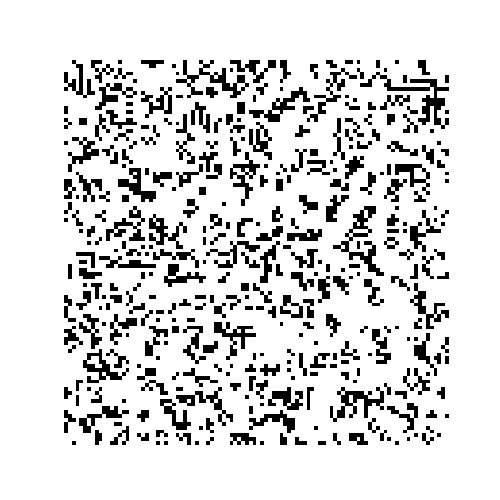

======================
Conway's game of life
======================

`Conway's game of life <http://en.wikipedia.org/wiki/Conway%27s_Game_of_Life>`__
in a periodic board.

At each step in time, the following transitions occur:

1. Any live cell with fewer than two live neighbours dies, as if
   caused by under-population.

2. Any live cell with two or three live neighbours lives on to the
   next generation.

3. Any live cell with more than three live neighbours dies, as if by
   overcrowding.

4. Any dead cell with exactly three live neighbours becomes a live
   cell, as if by reproduction.

License
-------

Licensed under `MIT license <https://opensource.org/licenses/MIT>`__
